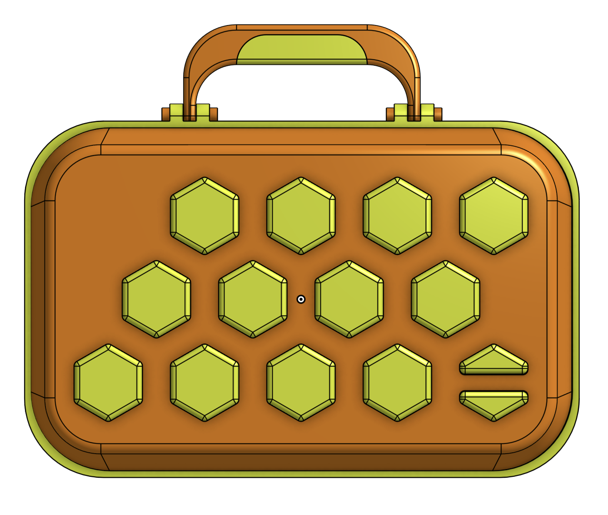

# Bumble Harp

### BOM

- a pile of 6x2mm circle magnets
- some keyboard switches, like for a mechanical keyboard. Reccomend 'silent' ones without any bump or click. probably a keyboards worth
- filament and a 3D printer. I am trying to use my smaller printer for everything, print envelope to follow

### CAD

[CAD is available in Onshape](https://cad.onshape.com/documents/0926d3b181919805e37e47c7/w/9472cb1f4be91defec4fba22/e/4f739bf295eab5d1871a2a5f)
 

# Build Notes

## CADing & Revising / Jan 21 2025

I want it to look like a toy and a lunch box. Some lofting and a center split allows me to print it all on the small (nice) printer if I stand the two case shells on their side and rotate them 45 degrees. Button testing has mostly paused as it has reached some sort of goodness, I have found that printing the button caps on their side, arranging print layers in the direction of press motion, reduces noise of the button press - it isn't silent but it is the same or quieter than a TE KO.II. 

I'm dropping the Linear Pot component due to space limitations, I think it would be better served in a seperate module which I might design in the future. Squeezing a linear pot and buttons for key and mode selection along with necessary MIDI channel select and octave toggle would result in a cluttered interface, and i am not a fan of shift function keys, which I will still have to use for selecting the MIDI channel (thinking 'hold up and down octaves and tap a key to count up channels' sorta approach, maybe coupled with 'hold up and tap down to move root by half step' )

The handle is not print in place. I did some print in place tests and they work fine, but I prefer the ability to replace a broken component, and print in place reduces that ability. The handle pins are using an anular snap fit, [i got the idea from here.](https://coloringchaos.github.io/form-fall-16/joints)

### Glamor Shots:

## init / Jan 14 2025

This is very early.

The idea is an arduino based & 3D printed velocity sensitive MIDI controller built without any particularily special or hard to track down components.

I am planning a hexagonal layout for 12 buttons, facilitating a [Tonnetz](https://en.wikipedia.org/wiki/Tonnetz) assisted approach to improvised melody & harmony, along with an interesting ergonomic setup for percussive controllerism. The goal is to integrate the harmony engine from [Chord Toy](https://github.com/b38tn1k/chordtoy), along with a linear pot (or some other 1-D motion signal generator) to provide something like an omnichord or what I imagine one of those accordians with the button lay out plays like. Combine the bee hive hexagon shapes with the omnichord strumming idea and you get Bumble Harp. I know bumble bees don't live in hives. 

The velocity tracking is pretty oldschool but works really nice - each 3D printed button hits two keyboard switches on press. The keyboard switches have a z offset between them, so one always closes before the other - the time between Switch 1 and Switch 2 closing can be used to make up a velocity value.

